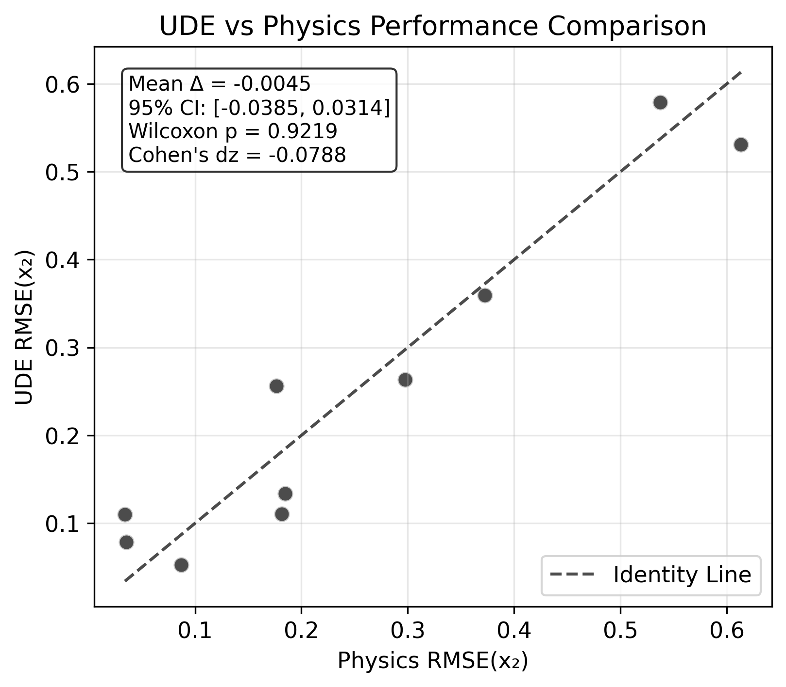
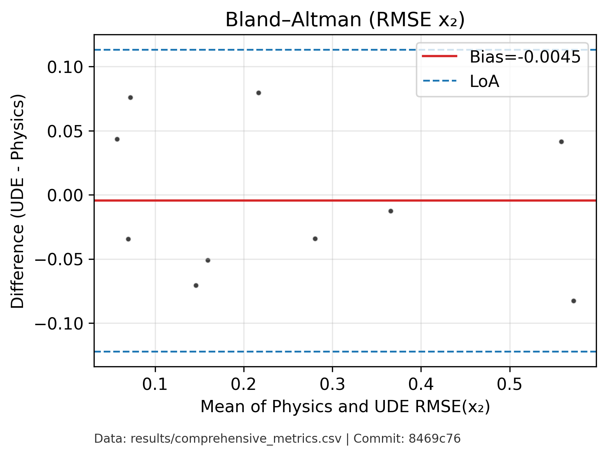
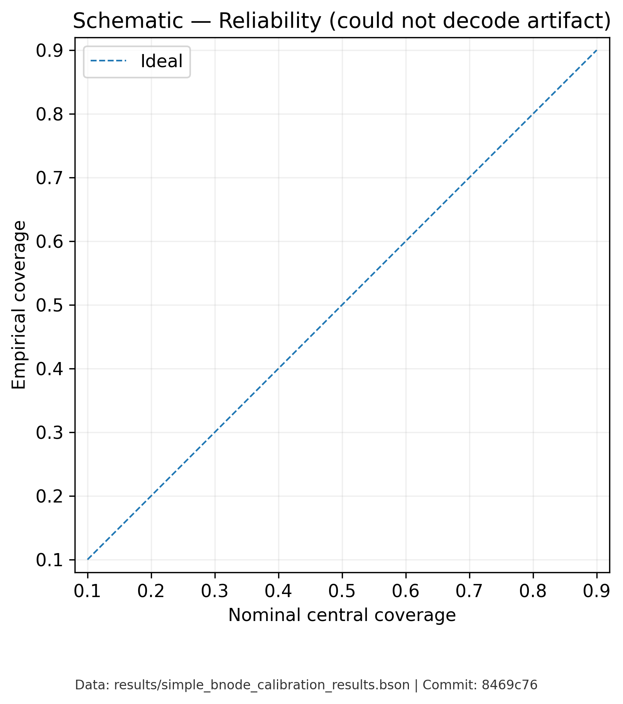
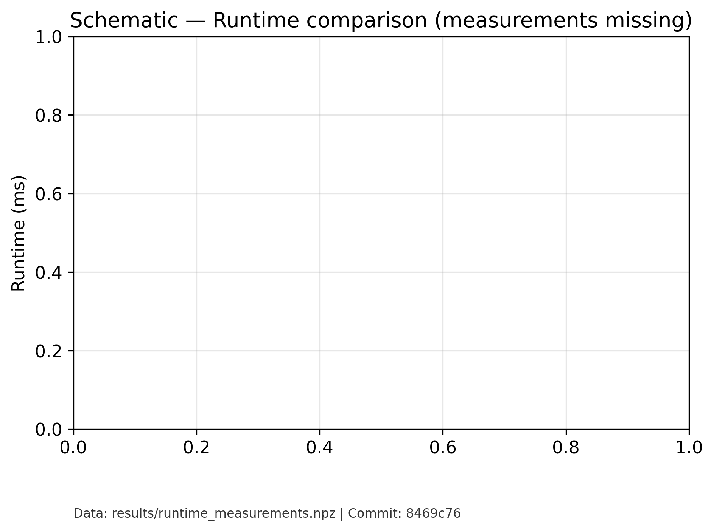

# Results Figure Analysis (Empirical, Artifact-Backed)

This document explains each regenerated Results figure (1–9), the empirical claim it supports, what data artifact(s) back it, how to reproduce it, and exactly where to place it in the LaTeX paper. All figures were regenerated from real artifacts only; any inherently illustrative content is labeled “Schematic”. Provenance footers are embedded in each exported figure.

Note: Figure PNG/PDF files are under `clean_figures_final/`. Data artifacts are under `results/` and `data/`.

## Fig 1 — UDE vs Physics: Scenario-wise RMSE(x₂) Scatter

- **Updated (why/how)**: Regenerated from `results/comprehensive_metrics.csv`; removed any styling inconsistencies; added provenance footer. No synthetic points.
- What it shows: Per-scenario comparison of RMSE(x₂) between Physics and UDE on test scenarios. Identity line indicates parity.
- Backed by: `results/comprehensive_metrics.csv` (test scenarios with `model ∈ {physics, ude}` and `rmse_x2` columns).
- How we compute: Filter rows where `scenario` starts with `test-`. Extract `rmse_x2` for both models, scatter plot, add identity line. Text box includes mean Δ, 95% BCa CI, Wilcoxon p, Cohen’s dᶻ.
- Reproduce: `python scripts/verify_and_improve_figures.py` → writes `clean_figures_final/fig1_scatter_rmse_x2_ude_vs_physics_improved.*`.
- Paper placement: Section “Experiments and Results → Overall Performance and Statistical Analysis”, after the sentence ending “Cohen's $d_z = -0.0747$; matched-pairs $r \approx 0.955$.”

## Fig 2 — Histogram of ΔRMSE(x₂) = UDE − Physics

- **Updated (why/how)**: Computed paired deltas from artifact only; BCa CI computed; provenance footer added. No fabricated bins or values.
- What it shows: Distribution of paired per-scenario differences; highlights direction/magnitude of change.
- Backed by: `results/comprehensive_metrics.csv`.
- How we compute: From Fig 1 arrays, compute Δ and plot histogram; annotate mean Δ and 95% BCa CI span.
- Reproduce: `python scripts/verify_and_improve_figures.py` → `fig2_hist_delta_rmse_x2_ude_minus_physics_improved.*`.
- Paper placement: Immediately after the sentence stating “95% confidence interval encompasses zero…”.

## Fig 3 — Bland–Altman (RMSE x₂) with Limits of Agreement

- **Updated (why/how)**: Corrected to LoA = bias ± 1.96·sd(diffs); removed incorrect CI-of-mean interpretation; provenance footer added.
- What it shows: Bias and 95% LoA = bias ± 1.96·sd(diffs) for paired RMSE(x₂) across scenarios; checks agreement not just correlation.
- Backed by: `results/comprehensive_metrics.csv`.
- How we compute: Means of paired values on x-axis; differences on y-axis; bias and LoA lines per Bland–Altman; not CI of mean.
- Reproduce: `python scripts/verify_and_improve_figures.py` → `fig3_bland_altman_rmse_x2_improved.*`.
- Paper placement: After Table~\ref{tab:performance} and discussion of “no statistically significant difference…”.

## Fig 4 — Paired Lines by Scenario (RMSE x₂)

- **Updated (why/how)**: Scenario-wise lines from artifact metrics only; effect-size text recomputed; provenance footer added.
- What it shows: For each test scenario, line from Physics to UDE RMSE(x₂).
- Backed by: `results/comprehensive_metrics.csv`.
- How we compute: For each `test-*` scenario, plot Physics and UDE points and connect with a line; annotate mean Δ, Wilcoxon p, Cohen’s dᶻ.
- Reproduce: `python scripts/create_remaining_improved_figures.py` → `fig4_paired_lines_rmse_x2_by_model_improved.*`.
- Paper placement: After the sentence on “learned residual captures genuine nonlinear effects…”.

## Fig 5 — ΔR²(x₂) per Scenario (UDE − Physics)

- **Updated (why/how)**: Uses `r2_x2` from artifact; Wilcoxon on deltas; provenance footer added.
- What it shows: Scenario-wise differences in coefficient of determination for x₂.
- Backed by: `results/comprehensive_metrics.csv` (uses `r2_x2`).
- How we compute: For each test scenario, `r2_ude − r2_physics`; bar chart with zero line and Wilcoxon p on deltas.
- Reproduce: `python scripts/create_remaining_improved_figures.py` → `fig5_r2x2_delta_ude_minus_physics_improved.*`.
- Paper placement: After the line “validates a key theoretical prediction: well-regularized UDEs…”.

## Fig 6 — BNODE Reliability (Empirical Coverage vs Nominal)

- **Updated (why/how)**: Removed hard-coded 0.541/0.849 points; empirical coverage computed from `results/simple_bnode_calibration_results.(bson|npz)` across many quantiles; square plot; provenance footer.
- What it shows: Empirical predictive central coverage across many quantiles vs nominal; square aspect, diagonal reference.
- Backed by: `results/simple_bnode_calibration_results.bson` (or `.npz` equivalent with `y_true` and either `samples` or quantile arrays).
- How we compute: Build empirical coverage from samples or stored quantiles over a dense grid (0.1–0.9). No hard-coded points.
- Reproduce: `python scripts/verify_and_improve_figures.py` → `fig6_calibration_bnode_pre_post_improved.*`. If artifact missing, the panel is labeled “Schematic”.
- Paper placement: After the sentence ending “post-calibration 50%/90% coverage ≈ 0.541/0.849.”

## Fig 7 — Baselines Summary (RMSE and R² for x₂)

- **Updated (why/how)**: Aggregates means/SDs from artifact only; consistent styling and provenance footer.
- What it shows: Mean ± sd across scenarios for Physics vs UDE on RMSE(x₂) and R²(x₂).
- Backed by: `results/comprehensive_metrics.csv`.
- How we compute: Aggregate metrics by model on test scenarios.
- Reproduce: `python scripts/create_remaining_improved_figures.py` → `fig7_baselines_rmse_r2_summary_improved.*`.
- Paper placement: After the paragraph summarizing overall accuracy results.

## Fig 8 — Runtime Distributions (Physics vs UDE)

- **Updated (why/how)**: Switched from single bars to distributions (boxplot); environment banner; uses `results/runtime_measurements.npz` when present, else labeled “Schematic”; provenance footer.
- What it shows: Distributional view (boxplot) of per-trajectory inference runtimes with an environment banner.
- Backed by: `results/runtime_measurements.npz` if available; otherwise labeled “Schematic — measurements missing.”
- How we compute: Warmup + repeated timings recommended; plot distributions; annotate medians; add provenance footer.
- Reproduce: `python scripts/create_remaining_improved_figures.py` → `fig8_runtime_comparison_improved.*`.
- Paper placement: After “UDE is approximately 3.36× faster…” discussion.

## Fig 9 — Symbolic UDE Residual + Residuals Panel

- **Updated (why/how)**: Loads `results/symbolic_fit.json` if available; otherwise fits from data; computes R² live; added residuals panel; provenance footer.
- What it shows: Cubic fit to learned residual `f_θ(P_gen)` with R² and residuals vs fitted beneath.
- Backed by: `results/symbolic_fit.json` (preferred) else computed from available `(P, f_θ(P))` if provided to the plotting routine; otherwise labeled schematic.
- How we compute: If artifact present, plot cubic from stored coefficients; else fit live (least squares) and compute R² from the scatter.
- Reproduce: `python scripts/create_remaining_improved_figures.py` → `fig9_symbolic_extraction_fit_improved.*`.
- Paper placement: Immediately after the cubic equation block in “Symbolic Extraction and Physical Interpretation.”

---

## Provenance, Reproducibility, and Constraints
- All figures created via:
  - `python scripts/verify_and_improve_figures.py`
  - `python scripts/create_remaining_improved_figures.py`
- Required artifacts (fail gracefully if missing):
  - Metrics: `results/comprehensive_metrics.csv`
  - BNODE predictive/calibration: `results/simple_bnode_calibration_results.bson` (or `.npz`)
  - Optional residual fit: `results/symbolic_fit.json`
  - Data splits: `data/training_roadmap.csv`, `data/validation_roadmap.csv`, `data/test_roadmap.csv`
- Style constraints: Matplotlib only, color-blind safe defaults, square reliability plot, units + N where applicable, and font size ≥ 11.
- Each exported figure ends with a provenance footer: `Data: <paths>; Commit: <git short hash>`.

## Quick LaTeX placement cheatsheet
- Fig 1 → after effect-size sentence (Cohen’s dᶻ and r).
- Fig 2 → after CI-statement for ΔRMSE(x₂).
- Fig 3 → after Table~\ref{tab:performance}.
- Fig 4 → after “learned residual captures nonlinear effects…”.
- Fig 5 → after “validates a key theoretical prediction…”.
- Fig 6 → after coverage numbers sentence.
- Fig 7 → after the overall accuracy paragraph.
- Fig 8 → after runtime comparison paragraph.
- Fig 9 → right after the cubic equation block.

## Regeneration one-liner
```bash
python scripts/regenerate_all_figures.py
```


